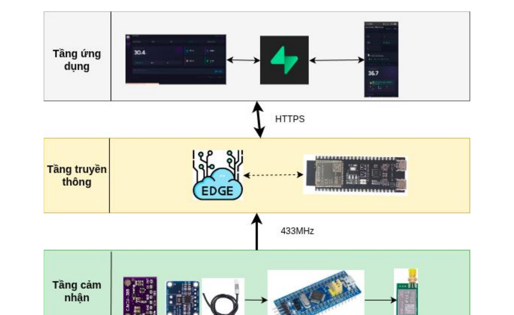
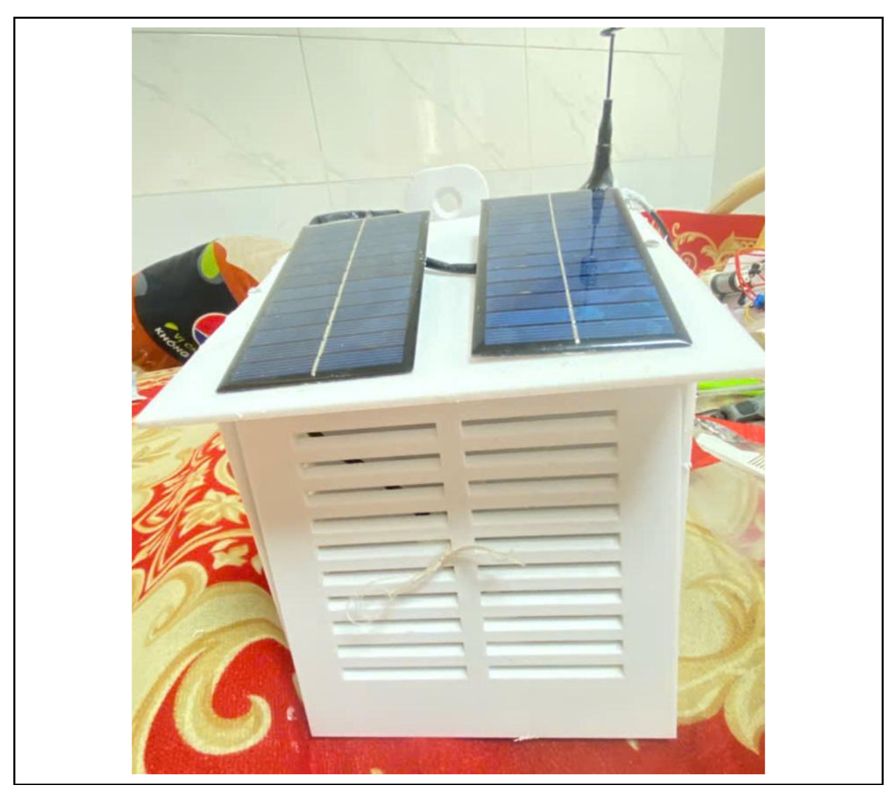
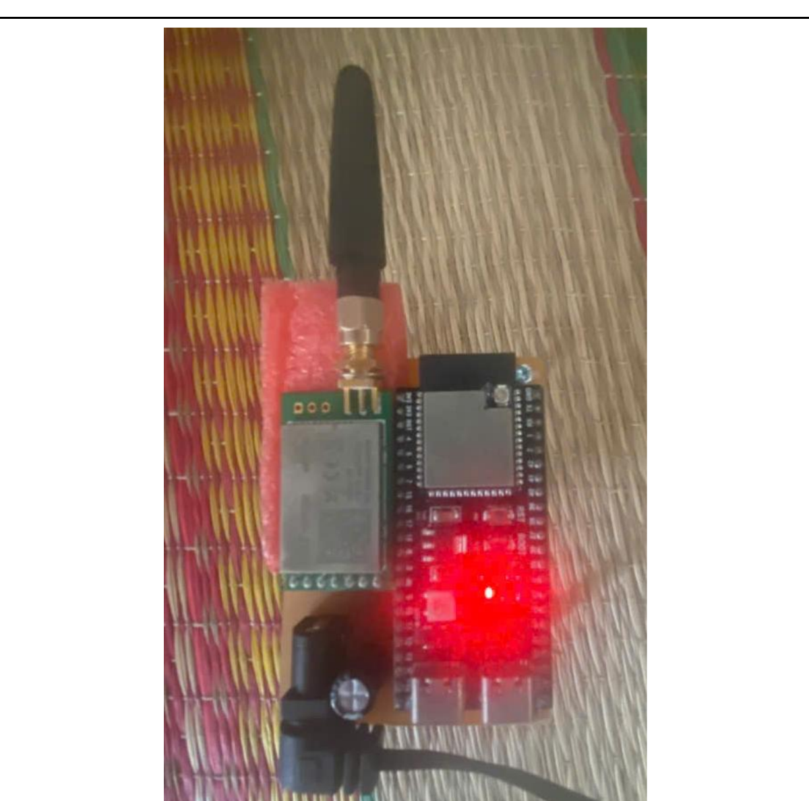
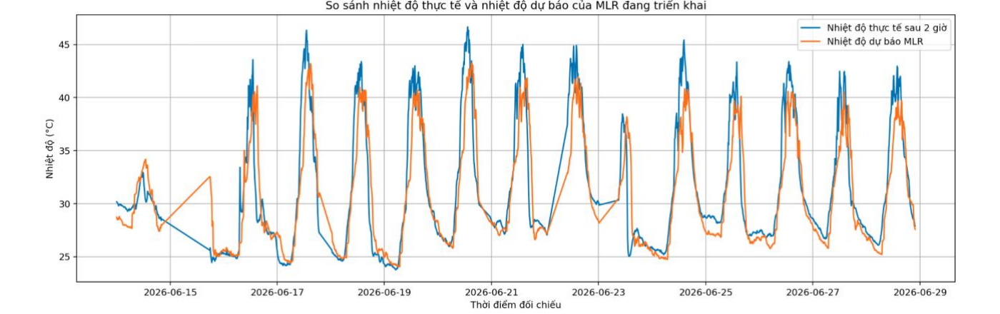
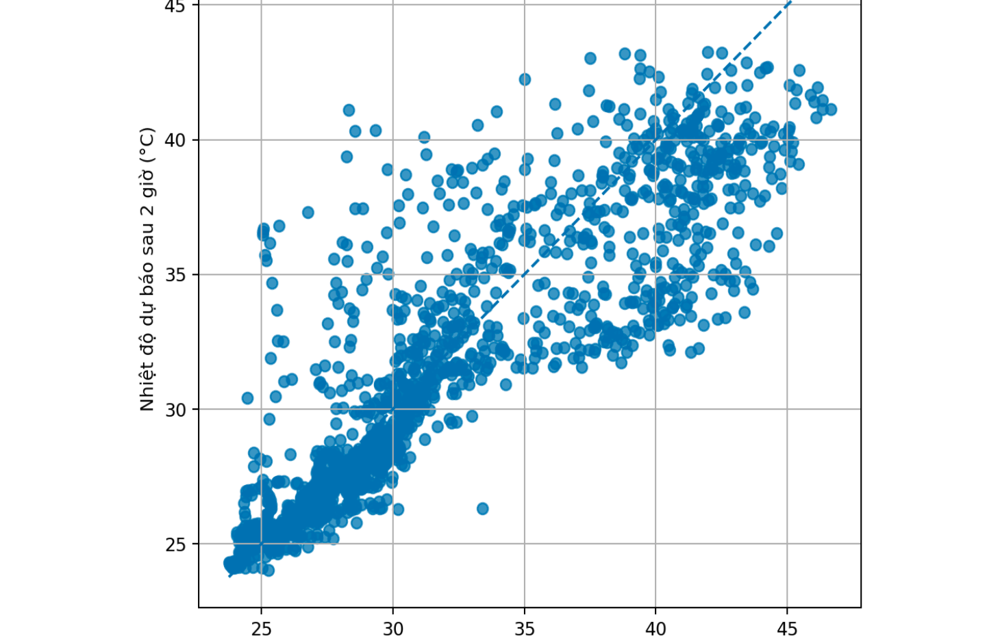
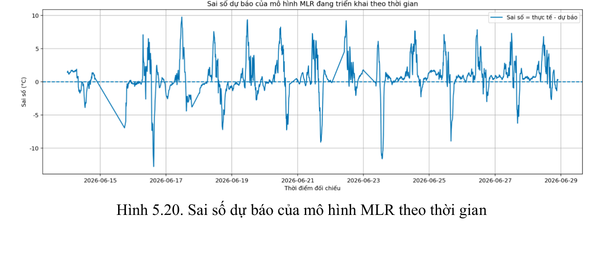

# Local Weather Monitoring Station

A local weather station for sites where a regional forecast does not describe the microclimate at the sensor. An STM32 node measures the environment, encrypts the reading, and sends it over LoRa. An ESP32-S3 gateway decrypts it, forecasts the temperature two hours ahead, and stores the result in Supabase.

**Team:** Nguyễn Thái Anh (23139002), Lê Đức Trí (23139049)
**Supervisor:** Dr. Huỳnh Thế Thiện, HCMC University of Technology and Education
**Report:** [report/23139002_23139049.pdf](report/23139002_23139049.pdf)

## What it does

Regional stations miss differences caused by vegetation, concrete, elevation, and shielding. This station measures temperature, humidity, pressure, and supply status at the installation point, then keeps that record available when the gateway has Wi-Fi.



*Figure 2.1. System architecture. Sensing at 433 MHz, gateway at the edge, application tier over HTTPS.*

| Tier | Role |
| --- | --- |
| STM32F103C8T6 node | Read SHT30, BMP388, and INA219; pack a 10-byte payload; encrypt it; transmit one LoRa frame per cycle |
| ESP32-S3 gateway | Authenticate and decrypt the frame, run the forecast, re-encrypt, and POST to Supabase |
| Supabase | Decrypt in an Edge Function, store rows in PostgreSQL, and serve the dashboard and OTA metadata |

The outdoor link uses ASCON-128a with a 4-byte authentication tag so the frame stays small. The gateway-to-cloud link uses a second key and a 16-byte tag. A leaked LoRa key does not expose the cloud key.

## Run the dashboard

The dashboard is static HTML. It reads rows that the Edge Function has already decrypted.

```bash
cd Software/iot-dashboard
python3 -m http.server 8080
```

Open `http://localhost:8080`. In **Config**, set the Supabase URL and table (`weather_logs`). The browser does not hold the ASCON key.

## Build the firmware

**Gateway** — ESP-IDF project `esp32_gateway`, target ESP32-S3. The managed provisioning component supports ESP-IDF 5.1 through 5.5 and 6.x; use an installed 5.x toolchain unless you have confirmed 6.x.

```bash
cd firmware/esp32
idf.py set-target esp32s3
idf.py build flash monitor
```

**Sensor node** — STM32CubeIDE project generated with STM32CubeMX 6.14.1 and STM32Cube FW_F1 V1.8.7.

```bash
# Open firmware/stm32/node_stm32_ver1 in STM32CubeIDE and build the Debug configuration.
```

There is no top-level Makefile for the STM32 tree.

## How the problems were handled

**Payload size on a small MCU.** AES-GCM is a poor fit for the STM32F103 frame budget. ASCON-128a encrypts the 10-byte payload in software. The LoRa frame is 18 bytes, including a 4-byte tag. The gateway checks that tag before it accepts the sample.

**Radio-on time.** The node does not stream. In each cycle it wakes, checks the schedule, reads the sensors, packs and encrypts the payload, sends one E32 frame at 433 MHz, and returns to standby. Sensors are SHT30, BMP388, and INA219 on I2C. The firmware uses GPIO, UART, RTC, and the independent watchdog.

**Forecast without an external weather API.** The gateway runs a multiple linear regression on temperature, humidity, pressure, and cyclical time features. It writes `predicted_temp_2h` locally. Section 5 gives the error on the deployed model.

**Field updates.** The dashboard hashes the `.bin` with SHA-256, uploads it to the `firmware` bucket, and writes `ota_url`, `ota_seq`, and `ota_sha256` in `device_configs`. The gateway downloads a new sequence, checks the digest, and skips a sequence it has already applied.

**No self-hosted server.** Supabase provides PostgreSQL, Realtime, Storage, and the Edge Function. The browser only sees plaintext that the function has already written.

## Hardware

The node is an STM32F103C8T6 board in a vented enclosure, charged from two solar panels through a CN3791 and a 1S lithium protection circuit.



*Assembled sensor node (Figure 4.3 in the report).*

The gateway is an ESP32-S3 N16R8 (16 MB flash, 8 MB PSRAM) with a LoRa E32 module on UART. PSRAM holds the TLS buffers and the regression coefficients.



*Assembled gateway (Figure 4.6 in the report).*

## Results

Evaluation used the deployed system, not a separate simulation. Details and plots are in Chapter 5 of the report.

**HTTPS latency** (Table 5.1), three trials:

| Path | Mean |
| --- | ---: |
| ESP32-S3 to Supabase Edge Function | 4595 ms |
| Web dashboard query to Supabase | 160 ms |

The gateway figure is the time from the start of the HTTPS request until the Edge Function responds, measured on the device. It moves with Wi-Fi and Edge Function load. The dashboard figure is the browser query, not the ingest path.

**ASCON.** The gateway rejects frames whose 4-byte tag does not match. Tampered frames do not enter the database.

**Forecast** (Table 5.2), 1755 paired samples from 13 June 2026 through 28 June 2026:

| Samples | MAE | RMSE | R² | Bias (actual − predicted) |
| ---: | ---: | ---: | ---: | ---: |
| 1755 | 1.84 °C | 2.79 °C | 0.771 | +0.62 °C |

The positive bias means the model tends to forecast low. Error is smaller at night, when temperature changes slowly, and larger between about 10:00 and 15:00. The largest residual in the set is −12.77 °C (forecast 41.10 °C, actual 28.33 °C two hours later, 16 June 2026, 13:00).



*Predicted temperature and the temperature measured two hours later (Figure 5.18).*



*Predicted versus actual temperature. The dashed line is y = x (Figure 5.19).*



*Forecast error over the evaluation window (Figure 5.20).*

**OTA.** Upload from the dashboard, SHA-256 check on the gateway, and flash completed. A repeated sequence number was ignored.

## Repository layout

```
firmware/esp32/     ESP-IDF gateway (FreeRTOS tasks, ASCON, LoRa, MLR)
firmware/stm32/     STM32CubeIDE sensor-node project
Software/iot-dashboard/   Static dashboard (index.html, chart.html)
Hardware/           Schematics and PCB
docs/images/        Figures cropped from the report
report/             Full report (PDF)
```

## Limits

- One sensor node and one gateway were deployed. The frame format can take more nodes; that load was not measured.
- Outdoor enclosure life (UV, heat cycling, rain) was not tested. Long-term solar autonomy was not optimized.
- The regression is a short-horizon reference. It does not replace a meteorological model, and it misses fast daytime swings. A rate-of-change feature and a longer record are the next step.
- Keys are static. Enrollment, rotation, and device identity are out of scope.
- The AEAD associated data is empty. Device ID, frame type, and a counter can be bound there later.

## References

Cited where the design depends on them:

- Dobraunig, C., Eichlseder, M., Grassi, L., et al. (2021). *ASCON v1.2: Lightweight Authenticated Encryption and Hashing*. NIST Lightweight Cryptography Standardization Process. Used for the AEAD on both links (Sections 3 and 5).
- Semtech Corporation. (2023). *LoRa Modulation Basics*, AN1200.22. Used for the 433 MHz E32 link.
- STMicroelectronics. *RM0008 Reference Manual: STM32F10xxx*. Register and peripheral behavior for the F103 firmware (STM32Cube FW_F1 V1.8.7).
- Espressif Systems. *ESP32-S3 Technical Reference Manual* and ESP-IDF programming guide. Gateway tasks, HTTPS, and OTA.
- Supabase. *Realtime, Storage, and Edge Functions*. https://supabase.com/docs. Cloud ingest, dashboard reads, and firmware hosting.
